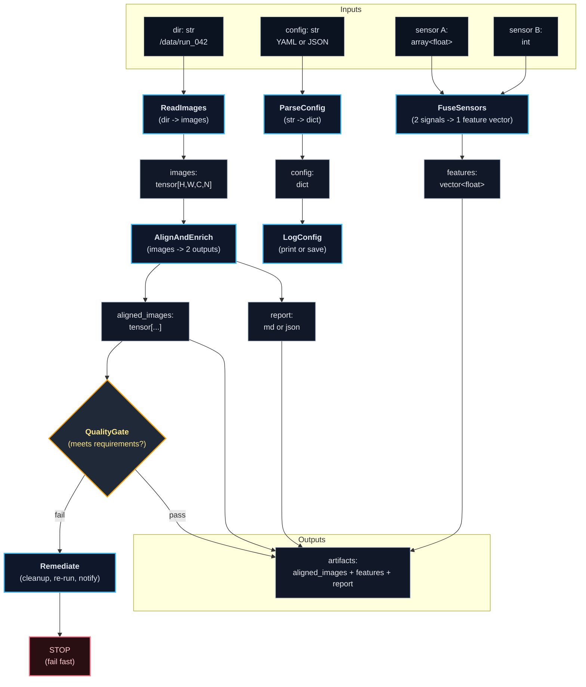

<div align="center">
  <a href="https://andrew-xqy.github.io/XFlow/">
    
  </a>

  <p>
    <a href="https://andrew-xqy.github.io/XFlow/"><b>Documentation</b></a>
    ·
    <a href="https://github.com/Andrew-XQY/XFlow/issues">Report Bug</a>
    ·
    <a href="https://github.com/Andrew-XQY/XFlow/issues">Request Feature</a>
  </p>
</div>


---

## About the Project

**XFlow** is a lightweight modular machine-learning framework.

Originally created for physics research, it's now evolving toward generic scientific applications ML workflows: **Data → Processing → Modeling**

<p align="center">
  
</p>

---

## Core Data Processing Pipeline (Computational Map example)
`flow` is a step-based computation map for data processing.

Inputs (possibly different data types) move through discrete steps. At each step, a sample either passes through unchanged (identity) or is transformed by a node. Nodes can be multi-input and multi-output, so the map can split and merge data streams. Optional meta nodes (debug, checks, routing) can log, validate, stop, or redirect (no loops, deterministic) the pipeline without changing the core step structure.



## Getting Started

### Installation

Install from PyPI:

```bash
pip install xflow-py
```

Clone the repository and install in editable mode:

```bash
git clone https://github.com/Andrew-XQY/XFlow.git
cd XFlow
pip install -e .
```
---

## Built With

<p>
  <a href="https://www.python.org/"></a>
  <a href="https://www.tensorflow.org/"></a>
  <a href="https://keras.io/"></a>
  <a href="https://pytorch.org/"></a>
</p>
</p>

- Python 3.12
- TensorFlow 2.x
- Keras 3.x
- PyTorch 2.5.x

---

## License

This project is licensed under the MIT License. See the [LICENSE](LICENSE) file for details.
